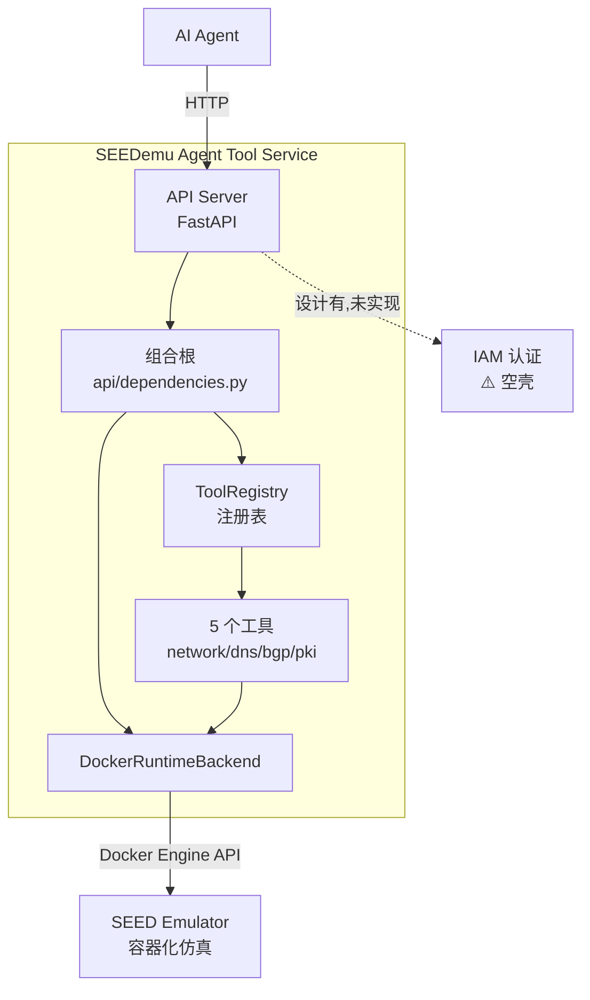

# seedemu-agent-tools 项目现状分析报告

> 分析日期：2026-08-18
> 分析基准：`main` 分支 @ `cf41149`（与 `origin/main` 完全同步，工作区干净）
> 上游仓库：`git@github.com:seed-labs/seedemu-agent-tools.git`（GPL-3.0）
> 分析环境：VM `zvanadium`（Ubuntu 24.04，Python 3.12.3，Docker 29.6.1）

---

## 1. 项目概述

**seedemu-agent-tools** 是面向 AI Agent 的 [SEED-Emulator](https://github.com/seed-labs/seed-emulator)（容器化互联网仿真框架）工具服务层。目标不是让 Agent 通过 shell 命令与仿真环境交互，而是提供**结构化、可发现、可验证**的接口，用于构建仿真、管理生命周期、检查网络状态、运行实验与诊断问题。

当前阶段：**初期开发阶段**（README 明确标注 "initial development stage"），核心骨架已成型、首批工具已落地，但设计文档中规划的能力仍有大量空缺。

### 开发历史

| 日期 | 提交 | 内容 |
|---|---|---|
| 2026-08-10 | 3 commits | Initial commit → 骨架结构 → 首批代码 |
| 2026-08-12 | 10 commits | design.md 反复修订、class-structure.md、追加 3 个工具域 |

共 13 个提交，单分支 `main`，作者 Kevin Du（wedu@acm.org）。

---

## 2. 项目结构

```text
seedemu-agent-tools/
├── README.md                  # 项目定位、设计原则、规划能力
├── LICENSE                    # GPL-3.0
├── .gitignore
├── docs/
│   └── tool-service/
│       ├── design.md          # 高层架构设计（组件职责、交互路径、边界）
│       └── class-structure.md # 类结构与调用序列（mermaid 图）
└── tool-service/              # FastAPI 工具服务（可安装 Python 包）
    ├── pyproject.toml         # hatchling 构建、依赖、pytest/ruff 配置
    ├── Dockerfile             # python:3.12-slim，非 root 用户，健康检查
    ├── compose.yaml           # docker.sock 挂载，read_only，no-new-privileges
    ├── .dockerignore
    ├── README.md              # 开发/运行/测试指南
    ├── seedemu_tool_service/  # 包源码（约 835 行）
    │   ├── main.py            # create_app() 应用工厂
    │   ├── config.py          # Settings dataclass（当前仅静态配置）
    │   ├── api/
    │   │   ├── router.py      # /api/v1 路由汇总
    │   │   ├── dependencies.py# 组合根：backend 单例 + registry 组装
    │   │   └── routes/
    │   │       ├── health.py  # GET /api/v1/health
    │   │       ├── runtime.py # GET /api/v1/runtime（不可用时 503）
    │   │       └── tools.py   # GET /api/v1/tools（工具发现）
    │   ├── auth/              # ⚠️ 仅占位 docstring，无任何实现
    │   ├── backends/
    │   │   ├── base.py        # RuntimeBackend Protocol（status / execute）
    │   │   └── docker.py      # Docker 实现 + 异常层次
    │   ├── models/
    │   │   ├── tool.py        # ToolDefinition / ToolListResponse
    │   │   ├── service.py     # ServiceInfo / HealthResponse
    │   │   └── runtime.py     # RuntimeStatus / RuntimeCommandResult
    │   ├── registry/
    │   │   └── registry.py    # ToolRegistry：register / list / invoke
    │   └── tools/             # 4 个工具域，每域三件套
    │       ├── network/       # models / tools / registration
    │       ├── dns/
    │       ├── bgp/
    │       └── pki/
    └── tests/                 # 29 个测试，7 个文件（约 634 行）
```

**代码规模**：包源码约 835 行 + 测试约 634 行，共约 1469 行。核心逻辑集中在 registry（69 行）、docker backend（68 行）与各工具域。

---

## 3. 技术栈

| 层次 | 技术 | 版本约束 | 说明 |
|---|---|---|---|
| 语言 | Python | >=3.11（VM 实测 3.12.3） | |
| Web 框架 | FastAPI | >=0.135,<1.0 | 实测 0.141.1 |
| ASGI 服务器 | Uvicorn | >=0.41,<1.0 | standard 扩展 |
| 数据校验 | Pydantic v2 | — | `model_validate` + `model_json_schema` 自动生成输入 Schema |
| 运行时后端 | docker SDK | >=7.2,<8.0 | Docker Engine API（VM 实测 daemon 29.6.1） |
| 异步 | anyio | — | 同步 handler 经 `to_thread.run_sync` 转入线程池 |
| 构建系统 | hatchling | >=1.27 | wheel 打包 |
| 测试 | pytest | >=8.4,<10.0 | 实测 9.1.1，29 个测试 |
| Lint | ruff | >=0.15,<1.0 | E/F/I/UP/B 规则，line-length 100 |
| HTTP 客户端(测试) | httpx2 | >=2.10,<3.0 | httpx 2.x 线（实测 2.11.0，注意与经典 httpx 0.x 不同包） |
| 容器化 | Docker + Compose | — | 非 root（uid 10001）、read_only、no-new-privileges、healthcheck |

**部署安全特性**（compose.yaml/Dockerfile 已具备，值得肯定）：
- 容器只读文件系统 + `/tmp` tmpfs；
- `no-new-privileges:true`、非 root 应用用户；
- docker.sock 通过 `group_add: ${DOCKER_GID}` 按需授权。

---

## 4. 架构分析

### 4.1 总体架构（对照 design.md）



设计文档定义了 6 大组件：API Server、IAM、Tool Registry、Tools、Runtime Backend、SEED Emulator。**当前实现覆盖其中 4 个**（API / Registry / Tools / Backend），**IAM 完全缺失**，Agent 侧未开发（设计上本就属于客户端范畴）。

### 4.2 关键设计模式（已实现）

1. **组合根模式**：`api/dependencies.py` 是唯一组装点——创建 Docker backend（`lru_cache` 单例）、构建 registry、依次调用各域的 `register_*_tools()`。新增工具域只需在此追加一行。
2. **注册表模式**：`ToolDefinition`（Agent 可见元数据）与 `handler`（可执行 callable）、`arguments_model`（显式 Pydantic 模型）分离注册；输入 JSON Schema 由参数模型自动派生，保证"发现即契约"。
3. **后端抽象**：工具只依赖 `RuntimeBackend` Protocol，不感知 Docker；替换为其他运行时（如 Kubernetes/本机进程）无需改动任何工具代码。
4. **工具域三件套**：每个域固定 `models.py`（严格参数模型，`extra="forbid"`）/ `tools.py`（bound-method 实现）/ `registration.py`（注册绑定），结构高度一致，可低成本复制扩展。
5. **注入安全**：容器内命令一律以 **argv 向量**传递（`exec_run(list(command))`），不经过 shell，规避命令注入。
6. **同步/异步兼容**：registry 支持 sync 与 async handler，同步调用经 anyio 线程池执行，不阻塞事件循环。

### 4.3 已实现工具清单（5 个）

| 工具名 | 域 | 底层命令 | 核心参数 |
|---|---|---|---|
| `network.inspect_ip_address` | network | 纯 Python `ipaddress`（无容器依赖） | address |
| `network.ping` | network | `ping -c N -W T <target>` | source, target, count(1-10), timeout |
| `dns.lookup` | dns | `dig +time +tries=1 +short [@server]` | source, name, record_type, server, timeout |
| `bgp.summary` | bgp | `vtysh -c "show bgp ipv4 unicast summary"` | source |
| `pki.inspect_certificate_file` | pki | `openssl x509 -noout -subject -issuer ...` | source, path |

约束：源容器需内置对应命令（dig/vtysh/openssl）；参数均带范围校验（count≤10、timeout≤30 等）。

### 4.4 HTTP API 现状（4 个端点）

| 方法 | 路径 | 说明 |
|---|---|---|
| GET | `/` | 服务元信息（含 docs_url） |
| GET | `/api/v1/health` | 存活检查 |
| GET | `/api/v1/runtime` | 后端可达性，不可用时返回 503 |
| GET | `/api/v1/tools` | 工具发现（名称/域/描述/JSON Schema） |

⚠️ **没有工具调用（invoke）端点**——`ToolRegistry.invoke()` 已实现并通过单元测试，但尚未暴露为 HTTP 接口。

---

## 5. 实测验证结果（2026-08-18，VM zvanadium）

| 验证项 | 结果 |
|---|---|
| 测试套件（临时 venv 安装 `.[dev]` 后） | ✅ **29/29 全部通过**（pytest 9.1.1，耗时 0.48s） |
| 服务启动（uvicorn，127.0.0.1:8000） | ✅ 正常 |
| `GET /api/v1/health` | ✅ `{"status":"ok","service":"SEEDemu Agent Tool Service","version":"0.1.0"}` |
| `GET /api/v1/tools` | ✅ 返回 5 个工具及完整 JSON Schema |
| `GET /api/v1/runtime` | ✅ HTTP 200，`{"backend":"docker","available":true,"daemon_version":"29.6.1"}` |
| `GET /openapi.json` | ✅ 含 /api/v1/{health,runtime,tools} 路径 |

测试覆盖分布：API 冒烟 5、registry 4、docker backend 4、network 5、dns 5、bgp 3、pki 3。**测试质量良好**：覆盖注册、参数校验、命令向量构造、成功/失败分支、backend 异常路径，且均用 fake backend，不依赖真实 Docker。

---

## 6. 现状评估：设计与实现的差距

| # | 差距项 | 现状 | 影响 |
|---|---|---|---|
| 1 | **IAM / 认证** | `auth/` 仅有 docstring | design.md 核心组件缺失；无鉴权时服务只能本地使用，**严禁暴露网络** |
| 2 | **工具调用端点** | registry.invoke 无 HTTP 出口 | Agent 只能"发现"不能"使用"工具，主链路未闭环 |
| 3 | **仿真发现/生命周期** | 无 list/build/start/stop 类工具 | README 规划的核心能力（构建场景、管理生命周期）全部未落地 |
| 4 | **错误码映射** | 容器不存在时异常直达 500 | 无 `RuntimeTargetNotFoundError` → 404 等映射，Agent 难以程序化处理错误 |
| 5 | **agents/ 目录** | 仓库布局中规划但未创建 | 无 Agent 提示词/编排资源 |
| 6 | **配置体系** | Settings 仅静态 dataclass，不支持环境变量 | compose 中的 `TOOL_SERVICE_PORT` 等 env 实际不被应用读取 |
| 7 | **CI/CD** | 无 `.github/` 工作流 | 无自动 lint/test 门禁 |
| 8 | **结构化输出** | ping/dig/BGP 输出均为原始文本透传 | 与"把仿真状态变成有用的、可预测的响应"的目标有差距 |
| 9 | **可观测性** | 无日志、无审计 | "Clear observability" 设计原则未实现 |

**总体评价**：骨架质量高——分层清晰、命名规范、docstring 完备、类型标注完整（ruff 全开）、设计文档先行、测试纪律好。但项目处于**"框架完成、闭环未通"**状态：工具可发现不可调用、无认证、无生命周期管理。

---

## 7. VM 环境现状

| 项 | 状态 |
|---|---|
| 操作系统 | Ubuntu 24.04（内核 7.0.0-28） |
| Python | 3.12.3（系统级，**项目无 venv**） |
| 项目依赖 | ⚠️ 未安装——系统 Python 缺 fastapi/uvicorn/pytest/httpx2（仅有 seedemu 相关的 docker 7.1.0、pydantic、httpx 0.28.1） |
| Docker | snap 安装（`snap.docker.dockerd` 运行中），API 29.6.1；**无镜像、无容器** |
| SEED-Emulator | `pip` 已装 seedemu 0.0.7 + `~/seed-emulator` 源码（含 docker_images 构建目录） |
| 代码同步 | 与上游 `origin/main` 0 ahead / 0 behind，工作区干净 |

> 说明：本报告编写时，测试运行所需的临时 venv 已按环境干净原则清理，仓库未产生任何变更。若要在 VM 上日常开发，建议在 `tool-service/` 下创建正式 `.venv`（`pip install -e ".[dev]"`）。

---

## 8. 下一步开发方向（建议优先级）

### P0 —— 打通 Agent 使用闭环（当前最紧迫）

1. **工具调用端点**：`POST /api/v1/tools/{name}/invoke`，复用 registry.invoke；同步补异常→HTTP 状态码映射（404 工具不存在/容器不存在、422 参数非法、502 后端故障、500 内部错误）。
2. **IAM 最小实现**：API Key/Token 认证（依赖注入 + 中间件），工具级权限声明（如 ping/dig 只读、未来生命周期工具需更高权限）。
3. **配置环境变量化**：引入 pydantic-settings，让 compose 的 env 真正生效（端口、DOCKER_HOST、认证密钥等）。

### P1 —— 补齐规划的核心能力

4. **仿真发现工具**：`emulation.list_nodes`（用 label 过滤 SEEDemu 容器）、`emulation.inspect_node`（IP/网络/服务信息）。
5. **生命周期工具**：编译/启动/停止仿真场景（对接 seedemu Python API 或 prebuilt 脚本），需先定义**安全边界**（哪些操作需显式确认、如何防误操作）。
6. **结构化输出解析**：将 ping/dig/BGP/证书原始输出解析为结构化结果模型（dig answers 已半结构化，可推广）。
7. **CI 门禁**：GitHub Actions（ruff + pytest），当前 lint/test 全本地手工。
8. **日志与审计中间件**：每次 invoke 记录调用者、工具、参数、耗时、结果状态。

### P2 —— 生态与扩展

9. **agents/ 资源**：示例 Agent 提示词、工具使用说明、编排示例；可评估直接暴露 **MCP（Model Context Protocol）** 接口——当前工具发现/JSON Schema 模型与 MCP tool 定义天然契合，转换成本低。
10. **新工具域**：routing（traceroute/路由表）、service（HTTP/SMTP/区块链 RPC 探测）、experiment（结果收集与实验可复现）。
11. **多后端**：验证 RuntimeBackend 抽象，扩展非 Docker 运行时。

---

## 9. 风险与注意事项

1. **docker.sock 挂载 = 宿主 Docker 全权**：compose 方案本质是特权服务。read_only/no-new-privileges 是必要但非充分防护——**在 IAM 落地前绝不能将 API 暴露到非信任网络**。
2. **参数注入面**：argv 向量已规避 shell 注入，但 `path`/`target` 等参数仍可操纵容器内文件/网络访问，工具上线前建议加参数白名单或允许列表策略。
3. **snap Docker 的差异**：VM 的 Docker 为 snap 安装，socket 位置与 cgroup 行为与 systemd 安装略有不同，compose 部署时注意 `DOCKER_GID` 配置。
4. **httpx2 是新生态包**：dev 依赖使用 httpx 2.x 线（PyPI 包名 `httpx2`），与常见 httpx 0.x 并存时注意依赖解析（实测 fastapi 0.141 TestClient 兼容，无冲突）。
5. **上游活跃**：最近提交距今仅 6 天（2026-08-12），本地跟进需定期 `git pull`，冲突风险低但需留意接口演进。
6. **仿真镜像缺失**：VM 上目前没有任何构建好的 SEEDemu 镜像/容器，功能级联调（真实 ping/dig/BGP）前需先完成 seedemu 镜像构建。
