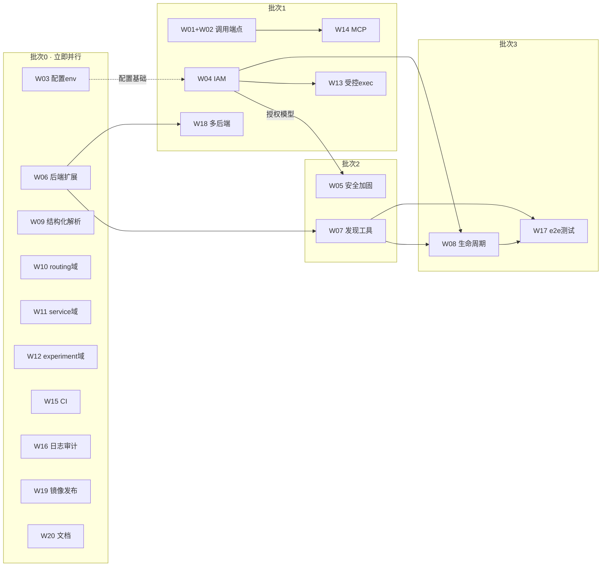

# seedemu-agent-tools 开发方向全景报告

> 生成日期：2026-08-18
> 基准：`main` @ `cf41149`，29/29 测试通过，5 工具 / 4 端点已验证
> 关联文档：[analysis-report.md](./analysis-report.md)（项目现状分析）
> 划分目标：**罗列全部待开发方向，并给出可并行执行的泳道与批次安排**

---

## 1. 现状速览（划分依据）

| 维度 | 现状 |
|---|---|
| 已实现 | 注册表 + 4 工具域 5 工具（ping / ip / dig / bgp / cert）+ Docker 后端 + 发现 API |
| 测试 | 29 个单元测试全绿，覆盖注册/校验/执行/异常路径 |
| 关键缺口 | 无调用端点、IAM 空壳、无生命周期/发现工具、无结构化解析、无 CI、配置静态化、agents/ 未建 |
| 设计债 | design.md 的 6 大组件只落地 4 个；README 规划能力大部分未实现 |

所有方向均源自：① design.md 组件职责；② README Planned Capabilities；③ 设计原则（安全/结构化/可观测/可复现）落地缺口；④ 工程化短板。

---

## 2. 开发方向总览（20 项）

| ID | 方向 | 所属泳道 | 依赖 | 规模 | 并行度 |
|---|---|---|---|---|---|
| W01 | 工具调用 HTTP 端点 | API 层 | 无 | M | ★ 解锁一切 |
| W02 | 异常→HTTP 状态码映射 | API 层 | W01* | S | 可并入 W01 |
| W03 | 配置环境变量化（pydantic-settings） | 工程质量 | 无 | S | 立即 |
| W04 | IAM：认证 + 工具级授权 | 安全层 | W03(软) | L | 独立 |
| W05 | 工具安全加固（白名单/风险分级） | 安全层 | W04(软) | M | 半独立 |
| W06 | 后端协议扩展（list/inspect 容器·镜像·网络） | 运行时层 | 无 | M | 立即 |
| W07 | 仿真发现工具（emulation.*） | 运行时层 | W06 | M | 同泳道串行 |
| W08 | 生命周期工具（build/start/stop） | 运行时层 | W07+W04 | L | 后期 |
| W09 | 结构化输出解析（ping/dig/bgp/cert） | 工具域 | 无 | M | 立即 |
| W10 | routing 域（traceroute/路由表/连通性） | 工具域 | 无 | M | 立即 |
| W11 | service 域（HTTP/SMTP/IMAP/RPC 探测） | 工具域 | 无 | M | 立即 |
| W12 | experiment 域（结果收集/日志/诊断） | 工具域 | 无 | M | 立即 |
| W13 | 泛化执行工具 exec（受控命令执行） | 安全层 | W04 | M | 中期 |
| W14 | agents/ + MCP 适配器 | API 层 | W01 | M | 中期 |
| W15 | CI 门禁（GitHub Actions: ruff+pytest） | 工程质量 | 无 | S | 立即 |
| W16 | 日志与审计中间件 | 工程质量 | 无 | S | 立即 |
| W17 | e2e 集成测试（真实 SEEDemu 场景） | 工程质量 | W07/W08+镜像 | L | 后期 |
| W18 | 多后端支持（非 Docker 运行时） | 运行时层 | W06 | L | 后期 |
| W19 | 服务镜像构建/发布与部署文档 | 工程质量 | 无 | S | 立即 |
| W20 | 开发者文档与贡献指南 | 工程质量 | 无 | S | 立即 |

> *W02 与 W01 同文件域，建议合并为一个任务或由同一人紧随完成。

---

## 3. 依赖关系图

**关键路径**（决定整体交付周期）：`W06 → W07 → W08 → W17` 与 `W03 → W04 → W05/W13` 两条主链，其余全部可挂起并行。

---

## 4. 泳道划分与并行安排

### 泳道 A —— API 与集成层
- **W01 工具调用端点**：`POST /api/v1/tools/{name}/invoke`，复用 `ToolRegistry.invoke()`；请求模型（工具名 + arguments dict）、响应模型、超时与并发语义。验收：真实 curl 调用 `network.inspect_ip_address` 返回结构化结果。
- **W02 异常映射**：`RuntimeTargetNotFoundError→404`、参数非法→422、后端故障→502、未知工具→404、兜底 500。建议与 W01 同一人完成。
- **W14 MCP 适配器 + agents/**：当前"发现即 JSON Schema"的模型与 MCP tool 定义天然同构；提供 MCP server 包装（FastMCP），把 5+ 工具暴露为标准 MCP 接口；agents/ 下放示例提示词与编排资源。**依赖 W01**。

### 泳道 B —— 安全层
- **W03 配置环境变量化**：引入 pydantic-settings；`Settings` 支持 env 覆盖（app_name、端口、DOCKER_HOST、认证密钥占位）；同步修正 compose.yaml 中 `TOOL_SERVICE_PORT` 等目前"写了不生效"的变量。**无依赖，先行**。
- **W04 IAM 最小实现**：API Key/Token 认证中间件 + 工具级权限声明（读操作 vs 危险操作两档起步）；认证失败 401、越权 403。验收：无 key 请求全部拒绝；有 key 可发现/调用被授权工具。
- **W05 安全加固**：参数白名单（如 BGP ASN 范围、证书路径前缀限制）、命令长度/输出大小上限、工具风险分级元数据（risk tier 进入 ToolDefinition）。
- **W13 受控 exec**：向仿真主机/路由器执行**已批准操作**的通路（白名单命令表 + 逐次审计），是 README "executing approved operations" 的落地。**依赖 W04 授权模型**。

### 泳道 C —— 运行时层
- **W06 后端协议扩展**：`RuntimeBackend` Protocol 增加 `list_containers()`、`inspect_container()`、`list_networks()` 等；Docker 实现用 label 约定（如 `seedemu-node=...`）过滤仿真节点。为 W07/W18 铺路，**无依赖**。
- **W07 仿真发现工具**：`emulation.list_nodes` / `emulation.inspect_node`（容器→IP/网络/服务映射）。依赖 W06。
- **W08 生命周期工具**：对接 seedemu Python API（VM 已装 0.0.7）：场景编译、启动、停止、销毁；必须先与 W04 权限分级对齐，危险操作需显式确认语义。依赖 W07 + W04。
- **W18 多后端**：以 W06 定型后的 Protocol 为契约，实现第二个后端（如本机进程/远程 SSH），验证抽象质量。依赖 W06 完成。

### 泳道 D —— 工具域扩展（并行度最高）
- **W09 结构化输出解析**：把 ping 统计、dig answer 段、BGP 汇总表、证书字段解析为 Pydantic 结果模型（现有工具原始文本透传，违背"结构化接口"原则）。每个工具域独立文件，**完全无冲突**。
- **W10 routing 域**：traceroute / `ip route` 表 / 连通性矩阵。标准三件套（models/tools/registration）+ 测试。
- **W11 service 域**：HTTP(S) 探测、SMTP/IMAP 会话、区块链 RPC 状态查询——对应 design.md 的"direct service operations"路径。
- **W12 experiment 域**：实验运行记录、结果/日志收集、可复现实验元数据——对应"可复现性"原则。
- 三个新域互不依赖、互不冲突，**可 3 人同时开工**。

### 泳道 E —— 工程质量
- **W15 CI**：`.github/workflows/ci.yml`：ruff check + pytest，PR 门禁。无依赖。
- **W16 日志审计中间件**：请求日志（方法/路径/耗时）、工具调用审计（谁/什么工具/参数摘要/结果状态）。注意与 W02 都动 `main.py`，需协调或让 W02 先合并。
- **W17 e2e 测试**：VM 上构建 SEEDemu 镜像，跑真实 mininet 场景验证 ping/dig/bgp 全链路；沉淀为可重复执行的集成测试套件。依赖 W07/W08 与镜像就绪。
- **W19 镜像构建/发布**：`docker compose build` 全流程验证（注意 VM 是 snap docker 的 GID 细节）、镜像 tag/推送策略、部署文档。
- **W20 开发者文档与贡献指南**：新增工具域的 step-by-step、贡献规范（README Contributing 节已承诺但未写）。

---

## 5. 文件冲突矩阵（并行执行的硬约束）

| 文件/区域 | 涉及任务 | 冲突说明 |
|---|---|---|
| `compose.yaml` / `Dockerfile` | W03 × W19 | **必须串行或明确分工**（W03 先改 env 注入，W19 在其上做发布） |
| `main.py` | W02 × W16 | 异常处理器 vs 中间件注册，**W02 先行** |
| `config.py` / `api/dependencies.py` | W03 × W04 | IAM 需要 env 配置能力，**W03 → W04 顺序执行** |
| `tools/*/models.py`、`tools/*/tools.py` | W05 × W09 | 加固改校验、解析改结果模型，同一批文件；**按工具域错开或协调** |
| `backends/base.py`、`backends/docker.py` | W06 × W18 | 同泳道内串行（W18 以 W06 产物为契约） |
| `tools/emulation/`（新建） | W07 × W08 | 同域新目录，串行 |
| 其余（新目录/新文件） | — | 各任务互不触碰，天然并行 |

---

## 6. 分批次编排建议（可并行窗口）

### 批次 0 —— 即刻可并行（10 项，无依赖无冲突）
W03、W06、W09、W10、W11、W12、W15、W16、W19、W20

> 这是当前最大的并行窗口：10 个方向分属 5 个泳道、文件域互斥。若多人协作，此批可同时铺开 5-8 人。

### 批次 1 —— 核心闭环（4 项）
W01+W02（调用端点+错误映射）、W04（IAM）、W13（受控 exec，紧随 W04）、W18（多后端，紧随 W06）

### 批次 2 —— 依赖第一批产物（2 项）
W07（发现工具）、W05（安全加固）

### 批次 3 —— 收口（2 项）
W08（生命周期）、W17（e2e 集成测试）

### 批次 4 —— 持续扩展
MCP 生态完善、更多工具域、多后端规模化、Agent SDK

---

## 7. 每个方向的验收标准（摘要）

| ID | 核心验收 |
|---|---|
| W01 | curl 真实调用返回结构化结果；未知工具/非法参数行为正确 |
| W02 | 404/422/502/500 语义正确且带机器可读错误体 |
| W03 | `TOOL_SERVICE_PORT=9000` 等 env 实际生效 |
| W04 | 无凭证全拒（401）；越权工具不可发现/不可调用（403） |
| W05 | 超范围参数被 422 拒绝；风险等级出现在 ToolDefinition |
| W06 | 协议方法齐全 + fake 后端测试 + Docker 实现对 label 过滤正确 |
| W07 | 对真实（或 fixture）仿真返回节点/网络清单 |
| W08 | 端到端：编译→启动→运行实验→停止→销毁 |
| W09 | 各工具返回解析后的结构化字段而非裸文本 |
| W10-W12 | 每域 ≥2 工具 + 单元测试 + 注册/发现闭环 |
| W13 | 白名单外命令被拒；每次执行有审计记录 |
| W14 | MCP 客户端可发现并调用全部已注册工具 |
| W15 | PR 上有 ruff+pytest 门禁且通过 |
| W16 | 每次 invoke 产生完整审计行 |
| W17 | 真实 mininet 场景下 ping/dig/bgp 结果正确 |
| W18 | 第二后端通过同一套工具测试 |
| W19 | 镜像可构建、容器健康检查通过、文档可复现 |
| W20 | 新人按文档可独立添加一个工具域 |

---

## 8. 风险与建议

1. **先 W01 后一切**：调用端点不通，任何工具新增都无法被 Agent 使用，价值无法验证。建议批次 0 与批次 1 实际只隔 1-2 天。
2. **W04 是安全红线**：docker.sock 级能力在无认证下绝不能对外暴露（现绑 127.0.0.1 即为此）。任何对外部署前必须完成 W04。
3. **同批并行前先过冲突矩阵**：第 5 节表格是并行安全性的唯一依据；跨任务动同一文件即失效。
4. **每域三件套模式是既定范式**：W10-W12、W13 应严格复制现有 `models/tools/registration` 结构与测试风格，保证注册表统一。
5. **e2e 依赖环境**：W17 需要先在 VM 完成 SEEDemu 镜像构建（当前 0 镜像）；可与 W19 协同推进。
