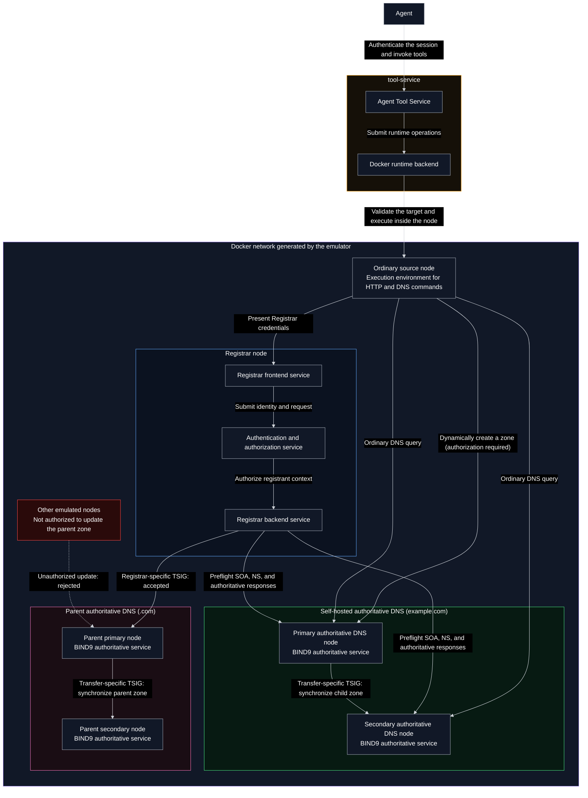

# GoDaddy-Style Registration Architecture with Self-Hosted Authoritative DNS

## DNS Tool Categories

DNS tools can be divided into three categories by responsibility:

1. **Basic tools**: Perform routine DNS queries and retrieve information, such as A, AAAA, NS, MX,
   TXT, and SOA records.
2. **Domain registration and update tools**: Change a domain and its DNS state, including the
   currently implemented domain availability check, domain registration, order status query,
   authoritative zone creation, record updates, nameserver configuration, and parent-zone
   delegation.
3. **Diagnostic tools**: Inspect DNS configuration and resolution paths, such as comparing responses
   from different servers; checking authority, delegation, glue, primary-secondary synchronization,
   and resolution consistency; and returning structured information for troubleshooting.

This design document focuses primarily on domain registration and update tools.

## Simplified Architecture Diagram

The diagram shows only deployment, services, and interfaces. It does not expand every call into a
sequence. See the textual workflow below for the complete order of operations.



## Nodes, Services, and Interfaces

### tool-service

The tool-service runs outside the emulated Docker environment. It does not access emulated addresses
directly. Instead, its Docker runtime backend executes commands inside the `source` container selected
by the Agent.

| Tool                | Function                                                   | Input                         | Output                         |
| ------------------- | ---------------------------------------------------------- | ----------------------------- | ------------------------------ |
| `registrar_find`    | Locate a Registrar frontend that the Agent may use         | Search criteria or none       | Registrar service location     |
| `registrar_request` | Read the Registrar frontend and send restricted same-origin requests | Domain registration request | Request processing result      |
| `dns_configure`     | Dynamically create a zone and maintain its records         | DNS configuration requirement | Configuration and verification result |

### Registrar Node

The Registrar may run on a newly added node or on an existing emulator node with the service
installed. It has two logical layers, which may run in the same container:

1. Registrar frontend: Provides a REST JSON API to the Agent and handles authentication, input
   models, error structures, and operation links.
2. Registrar backend: Handles domain allocation, ownership, quotes, idempotency, SQLite transactions,
   asynchronous tasks, glue, and parent-zone delegation.

The frontend does not provide a dedicated capabilities API. The Agent first reads the Registrar's
public web pages and same-origin JavaScript, infers available business operations from forms, request
code, and response handling, and then sends requests through `registrar_request`. The tool-service
must still restrict requests to the Registrar origin confirmed by `registrar_find` and constrain
dangerous methods, redirects, and cross-origin access. The Agent's ability to infer an interface does
not mean that the Registrar accepts arbitrary requests.

### Self-Hosted Authoritative DNS Nodes

The authoritative DNS service may be installed on newly added nodes or existing emulator nodes. Both
nodes run the BIND9 authoritative service generated by SeedEmu `DomainNameService`. The primary is
`ns1.example.com` (for example, `10.161.0.53`), and the secondary is `ns2.example.com` (for example,
`10.162.0.53`).

The existing `DomainNameService.py` primarily supports build-time configuration: it can only generate
zones and primary-secondary relationships in advance. After the containers start, it cannot create an
unknown zone, and it lacks runtime TSIG authorization management and primary-secondary convergence
verification.

This design plans to add a runtime-zone mode to the service. It is disabled by default and does not
introduce a separate DNS control service. `dns_configure` first verifies that the current `source` is
authorized for the DNS nodes and zone. If the zone does not exist, it provisions the zone and
dynamically establishes the primary and secondary. After the zone is loaded, records are maintained
through RFC 2136 with an update TSIG, while a separate transfer TSIG secures synchronization between
the primary and secondary.

### Parent Authoritative DNS Nodes

The parent zone continues to use the existing `.com` primary and secondary nodes from B02.

## `example.com` Textual Workflow (Reference Only, Not the Final Implementation)

This design supports two approaches commonly found in real-world systems:

1. **Combined registration and delegation**: Configure the self-hosted authoritative DNS in advance,
   submit the nameservers in the registration quote, and let the Registrar complete the parent-zone
   delegation after registration succeeds. This section uses this approach as its example.
2. **Nameserver update after registration**: Complete registration using the default nameservers,
   configure the self-hosted authoritative DNS afterward, and then submit a separate nameserver update.
   The update uses a separate asynchronous operation and does not purchase the domain again.

The reference workflow is:
`Availability Check → Authoritative DNS Configuration → Registration Quote with Nameservers → Registration and Delegation`.

### 1. Registrar Service Discovery

1. The Agent calls `registrar_find`.
2. The tool-service returns the Registrar node and the location of its public website from the
   authorized service directory. It does not list interface names or functions and does not return any
   secrets.
3. The Agent explicitly selects a Registrar, reads its HTML and same-origin JavaScript, and infers page
   behavior such as availability checking, quoting, registration, operation lookup, and nameserver
   updates. It references the Registrar `credential_ref` configured by the environment for the current
   principal.

### 2. Availability Check

4. Through `registrar_request`, the Agent invokes the availability check for `example.com`.
5. If the domain is unavailable, the workflow ends without creating an order or DNS zone.

### 3. Authoritative DNS Configuration

6. The Agent calls `dns_configure` through the `source` it currently controls. The tool-service verifies
   that the `source` belongs to the current emulated environment and is authorized to manage the two
   self-hosted DNS nodes and `example.com`. If the zone does not yet exist, the tool-service creates and
   loads a primary zone on the primary node and a secondary zone on the secondary node, while installing
   separate update and transfer TSIG keys. After provisioning the zone, it uses RFC 2136 to write the
   following records to the primary:

```dns
example.com.     SOA  ns1.example.com. hostmaster.example.com. (...)
example.com.     NS   ns1.example.com.
example.com.     NS   ns2.example.com.
ns1.example.com. A    10.161.0.53
ns2.example.com. A    10.162.0.53
www.example.com. A    10.160.0.80
```

7. Using the transfer-specific TSIG, the primary notifies the secondary and completes AXFR/IXFR.
8. `dns_configure` verifies the SOA, NS, serial, and `AA=1` response from the explicit IP address of
   each server. Because the parent zone has not delegated the domain yet, this step cannot depend on
   recursive resolution to locate the servers.

### 4. Registration and Delegation

9. The Agent requests a registration quote and submits the self-hosted nameservers in the registration
   configuration:

```text
ns1.example.com
ns2.example.com
```

10. The Registrar checks domain availability again and directly performs a preflight check against the
    two authoritative DNS servers. If the checks pass, it returns a short-lived `quote_token` containing
    the final nameserver configuration.
11. The Agent executes the registration using the `quote_token` and an `Idempotency-Key`. In a
    transaction, the Registrar performs a final check and allocates `example.com`, then creates an
    asynchronous registration-and-delegation operation.
12. Using its parent-zone-specific TSIG, the Registrar writes the NS records for `example.com` to COM-A.
    It also writes the required glue for in-domain nameservers. COM-A then synchronizes the zone to
    COM-B using the transfer-specific TSIG.
13. The Registrar verifies the parent referral and glue, as well as authoritative responses from both
    child-zone servers. Once all results are consistent, it marks the domain and operation as `active`.
    If delegation fails, the domain remains registered and enters `pending_delegation` or `failed`; its
    ownership is not rolled back.
14. The Agent polls the operation or domain status. Once complete, it may continue maintaining business
    records through `dns_configure`.

When the second approach is used, the registration quote does not include the self-hosted nameservers.
After registration succeeds, the workflow performs the DNS configuration in Section 3 and submits a
separate nameserver update request to complete Steps 12 through 14.
