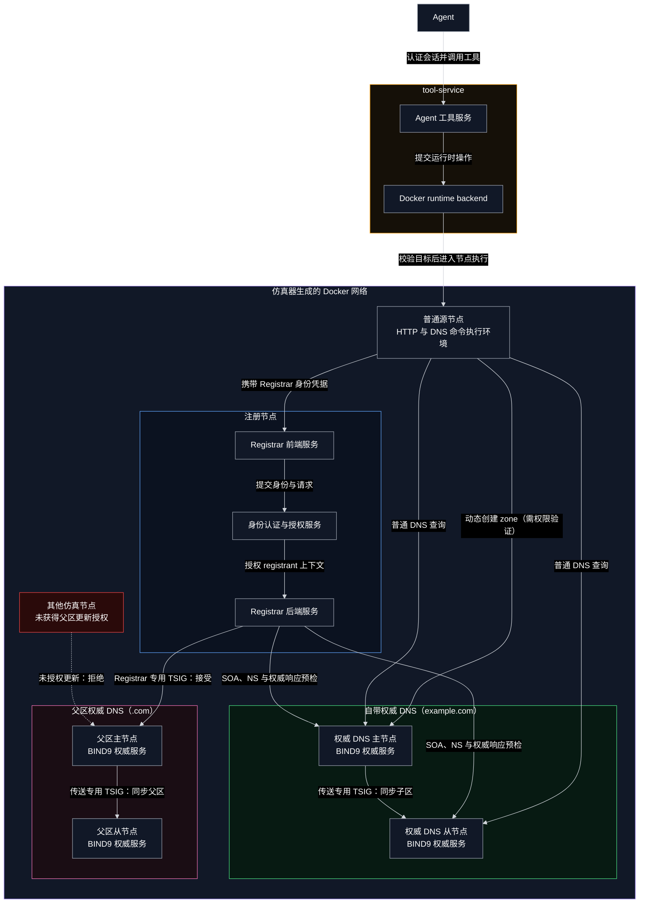

# GoDaddy 风格的自带权威 DNS 注册架构

## DNS tools 分类

DNS tools 按职责可以分为三类：

1. **基础工具**：完成常规 DNS 查询与信息获取，例如查询 A、AAAA、NS、MX、TXT、SOA
   等记录。
2. **域名注册及更新工具**：负责改变域名及其 DNS 状态，包括当前实现中的域名可用性查询、
   域名注册、订单状态查询、权威 zone 创建、记录更新、nameserver 设置以及父区委派。
3. **诊断工具**：用于检查 DNS 配置和解析链路，例如比较不同服务器的响应、检查权威性、
   委派、glue、主从同步和解析结果是否一致，并返回可定位问题的结构化信息。

本设计文档主要实现域名更新工具。

## 简化架构图

架构图只表达部署、服务和接口，不展开每一次调用的时序。完整顺序见后面的文字流程。



## 节点、服务与接口

### tool-service

tool-service 位于仿真 Docker 外部。它不直接访问仿真地址，而是通过 Docker runtime
backend 在 Agent 选择的 `source` 容器内执行命令。

| 工具                  | 功能                                  | 输入         | 输出           |
| --------------------- | ------------------------------------- | ------------ | -------------- |
| `registrar_find`    | 定位允许 Agent 使用的注册节点前端     | 查找条件或无 | 注册服务位置   |
| `registrar_request` | 读取 Registrar 前端并发送受限同源请求 | 注册业务请求 | 请求处理结果   |
| `dns_configure`     | 动态创建 zone，并维护 zone 内的记录   | DNS 配置需求 | 配置与验证结果 |

### 注册节点

注册节点可新加或使用仿真器已有节点并安装服务。注册节点安装两个逻辑层，可以运行在同一容器中：

1. Registrar 前端：面向 Agent 的 REST JSON API，负责认证、输入模型、错误结构和
   operation 链接。
2. Registrar 后端：负责域名占有、所有权、quote、幂等、SQLite 事务、异步任务、glue
   和父区委派。

前端不提供单独的 capabilities API。Agent 先读取 Registrar 的公开网页和同源 JavaScript，依据
页面表单、请求代码及响应处理推断可执行的业务步骤，再通过 `registrar_request` 发起请求。
tool-service 仍须把请求限制在 `registrar_find` 确认的 Registrar origin 内，并限制危险的
method、重定向和跨源访问；“Agent 能推理接口”不等于“Registrar 接受任意请求”。

### 自带权威 DNS 节点

权威 DNS 节点可新加或使用仿真器已有节点并安装服务。两个节点都安装 SeedEmu `DomainNameService` 生成的 BIND9 权威服务：主节点为`ns1.example.com`（例如 `10.161.0.53`），从节点为 `ns2.example.com`（例如`10.162.0.53`）。

现有 `DomainNameService.py` 主要面向编译期配置，只能预先生成 zone 和主从关系；容器
启动后不能创建未知 zone，也缺少运行时 TSIG 权限管理和主从收敛验证。

本设计计划在该服务中增加默认关闭的 runtime-zone 模式，不引入独立的 DNS 控制服务。
`dns_configure` 先验证当前 `source` 对 DNS 节点和 zone 的权限；zone 不存在时执行
provisioning，动态建立 Primary/Secondary；zone 加载后再通过 RFC 2136 + update TSIG
维护记录，并使用独立的 transfer TSIG 完成主从同步。

### 父区权威 DNS 节点

父区继续使用B02已有的 `.com` 主从节点。

## `example.com` 文字流程（参考流程，不代表最终实现）

本设计支持两种现实中常见的方式：

1. **注册与委派一并处理**：提前配置自带权威 DNS，在 registration quote 中提交
   nameserver，注册成功后由 Registrar 同时完成父区委派。本节以这种方式为例。
2. **注册后更新 Nameserver**：先使用默认 nameserver 完成注册，之后配置自带权威 DNS，
   再单独提交 nameserver update。该更新使用独立的异步 operation，但不重新购买域名。

下面的参考流程为：
`Availability Check → Authoritative DNS Configuration → Registration Quote with Nameservers → Registration and Delegation`。

### 一、Registrar Service Discovery

1. Agent 调用 `registrar_find`。
2. tool-service 从授权服务目录返回注册节点及其公开网页位置，不直接列出接口名称和功能，
   也不返回任何 secret。
3. Agent 显式选择一个 Registrar，读取其 HTML 和同源 JavaScript，自行推断 availability、
   quote、registration、operation 查询和 nameserver 更新等页面行为，并引用环境为当前
   principal 配置的 Registrar `credential_ref`。

### 二、Availability Check

4. Agent 通过 `registrar_request` 调用 availability，查询 `example.com`。
5. 若不可用，流程结束，不创建订单和 DNS zone。

### 三、Authoritative DNS Configuration

6. Agent 通过当前控制的 `source` 调用 `dns_configure`。tool-service 验证该 `source`
   是否属于当前仿真环境，以及它是否获准管理两个自带 DNS 节点和 `example.com`；发现
   zone 尚不存在后，在主节点创建并加载 primary zone，在从节点创建并加载 secondary
   zone，同时安装相互分离的 update/transfer TSIG。完成建区后，再通过 RFC 2136 向
   主节点写入：

```dns
example.com.     SOA  ns1.example.com. hostmaster.example.com. (...)
example.com.     NS   ns1.example.com.
example.com.     NS   ns2.example.com.
ns1.example.com. A    10.161.0.53
ns2.example.com. A    10.162.0.53
www.example.com. A    10.160.0.80
```

7. 主节点使用传送专用 TSIG 通知从节点完成 AXFR/IXFR。
8. `dns_configure` 按两个服务器的明确 IP 验证 SOA、NS、serial 和 `AA=1`；此时父区
   尚未委派，因此不能依赖递归解析找到它们。

### 四、Registration and Delegation

9. Agent 请求 registration quote，并在注册配置中提交自带 nameserver：

```text
ns1.example.com
ns2.example.com
```

10. Registrar 再次检查域名可用性，并直接预检两个权威 DNS；检查通过后返回包含最终
    nameserver 配置的短期 `quote_token`。
11. Agent 使用 `quote_token` 和 `Idempotency-Key` 执行 registration。Registrar 在事务
    内最终检查并占有 `example.com`，随后创建注册与委派的异步 operation。
12. Registrar 使用父区专用 TSIG 向 COM-A 写入 `example.com` 的 NS；对于域内
    nameserver，同时写入必要 glue。COM-A 再使用传送专用 TSIG 同步到 COM-B。
13. Registrar 验证父区 referral/glue 和两个子区服务器的权威响应。全部一致后，将域名
    和 operation 标记为 `active`；如果委派失败，域名保持已注册并进入
    `pending_delegation` 或 `failed`，不会回滚域名所有权。
14. Agent 轮询 operation/domain 状态；完成后可继续用 `dns_configure` 维护业务记录。

如果采用第二种方式，则 registration quote 不携带自带 nameserver；域名注册成功后，
再执行第三节的 DNS 配置，并通过独立的 nameserver update 请求完成第 12 至 14 步。
